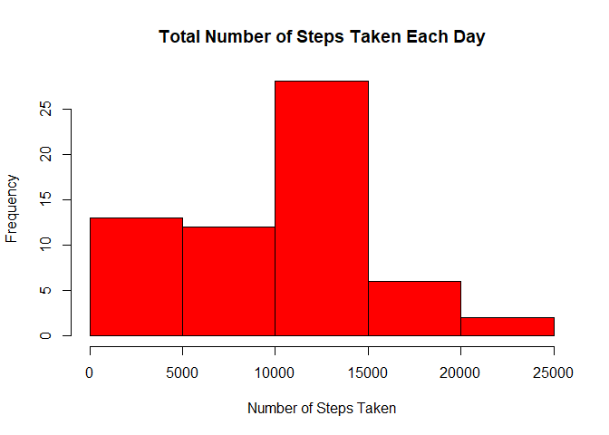
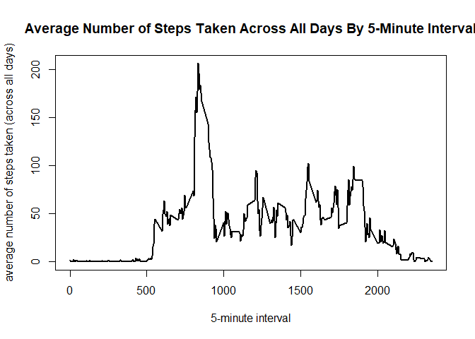
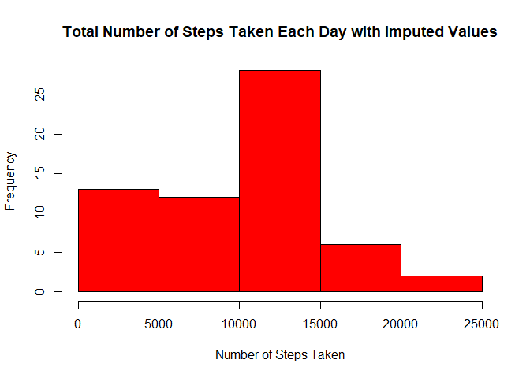
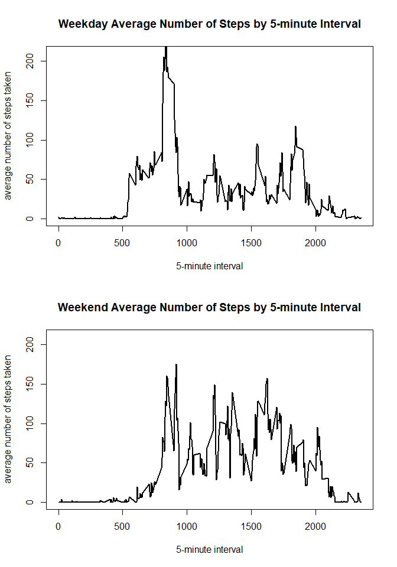

# Reproducible Research: Peer Assessment 1


## Loading and preprocessing the data
The below code loads the data and changes the class of the date column to date.

```r
unzip("activity.zip")
dat<-read.csv("activity.csv",header = TRUE)
dat$date<-as.Date(dat$date,format="%Y-%m-%d")
```

## What is mean total number of steps taken per day?
Calculate the total number of steps taken per day.

```r
daily<-with(dat, tapply(steps, date, sum, na.rm=TRUE))
```
Below is a histogram of the total number of steps taken each day.  

```r
hist(daily,xlab="Number of Steps Taken",main="Total Number of Steps Taken Each Day",col="red")
```

<!-- -->

The code below calculates and reports the mean and median total number of steps taken per day.

```r
mean(daily)
```

```
## [1] 9354.23
```

```r
median(daily)
```

```
## [1] 10395
```


## What is the average daily activity pattern?
Below is the code that makes a time series plot of the 5-minute interval (x-axis) and the average number of steps taken, averaged across all days (y-axis).

```r
min<-with(dat,tapply(steps,interval,mean,na.rm=TRUE))
df<-data.frame(interval=as.numeric(names(min)),avgsteps=min)
plot(df$interval,as.numeric(df$avgsteps),type="l",lwd=2,xlab="5-minute interval",ylab="average number of steps taken (across all days)",main="Average Number of Steps Taken Across All Days By 5-Minute Interval")
```

<!-- -->

The code below which 5-minute interval, on average across all days in the dataset, contains the maximum number of steps.

```r
df$interval[which.max(df$avgsteps)]
```

```
## [1] 835
```


## Imputing missing values
The total number of missing values in the dataset is generated by the code below.

```r
sum(is.na(dat$steps))
```

```
## [1] 2304
```

The code below imputes the missing values of the datasets by replacing NAs with the mean steps for that day and places this information in a new dataset called dat2.

```r
dat2<-dat
dailya<-with(dat, tapply(steps, date, mean, na.rm=TRUE))
dat2$avgdaily<-rep(dailya,each=288)
dat2$steps<-ifelse(is.na(dat2$steps), dat2$avgdaily, dat2$steps)
dat2$avgdaily<- NULL
```

The next section of code makes a histogram of the total number of steps taken each day.

```r
daily2<-with(dat2, tapply(steps, date, sum, na.rm=TRUE))
hist(daily2,xlab="Number of Steps Taken",main="Total Number of Steps Taken Each Day with Imputed Values",col="red")
```

<!-- -->

Below are the mean and median total number of steps taken per day.

```r
mean(daily2)
```

```
## [1] 9354.23
```

```r
median(daily2)
```

```
## [1] 10395
```
The mean and median are equal to the estimates from the first part of the assignment due to the method of imputation. Imputing missing data increases the estimates of the total daily number of steps.


## Are there differences in activity patterns between weekdays and weekends?
The code below creates a new factor variables in the dataset with two levels - "weekday" and "weekend" indicating whether a given date is a weekday or weekend day.

```r
dat2$weekdaystatus<-ifelse((weekdays(dat2$date)=="Saturday"|weekdays(dat2$date)=="Sunday"),"weekend","weekday")
dat2$weekdaystatus<-as.factor(dat2$weekdaystatus)
```

The code below makes a panel plot containing a time series plot of the 5-minute interval (x-axis) and the average number of steps taken, averaged across all weekday days or weekend days (y-axis).

```r
end<-subset(dat2,dat2$weekdaystatus=="weekend")
day<-subset(dat2,dat2$weekdaystatus=="weekday")
endmin<-with(end,tapply(steps,interval,mean,na.rm=TRUE))
daymin<-with(day,tapply(steps,interval,mean,na.rm=TRUE))
enddf<-data.frame(interval=as.numeric(names(endmin)),avgsteps=endmin)
daydf<-data.frame(interval=as.numeric(names(daymin)),avgsteps=daymin)
par(mfcol=c(2,1))
plot(daydf$interval,as.numeric(daydf$avgsteps),lwd=2,type="l",xlab="5-minute interval",ylab="average number of steps taken",main="Weekday Average Number of Steps by 5-minute Interval",ylim=c(0,210))
plot(enddf$interval,as.numeric(enddf$avgsteps),lwd=2,type="l",xlab="5-minute interval",ylab="average number of steps taken",main="Weekend Average Number of Steps by 5-minute Interval",ylim=c(0,210))
```

<!-- -->
